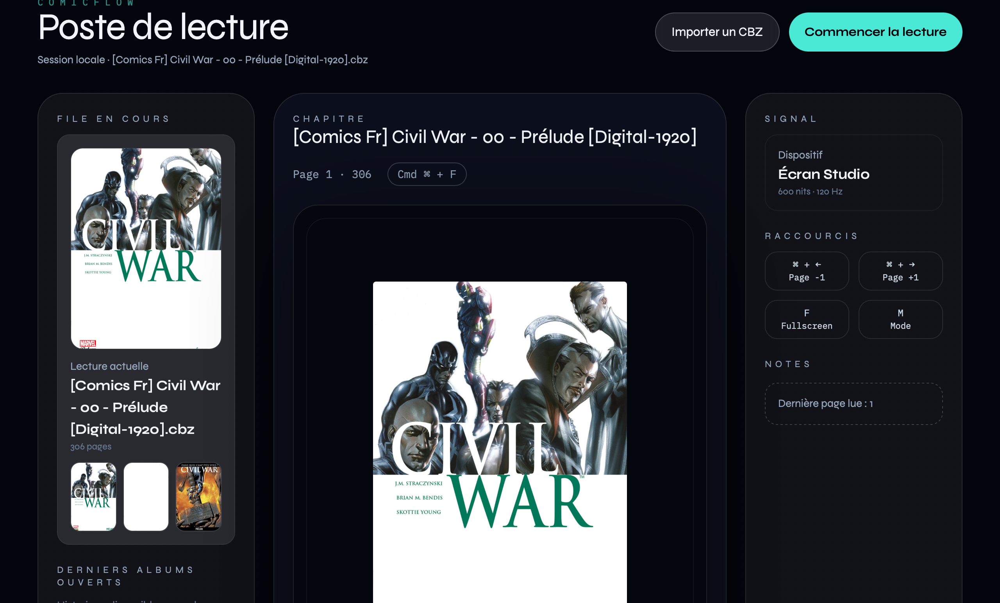

# ComicFlow | Lecteur CBZ Tauri

ComicFlow passe du prototype web à une application desktop complète : Rust + Tauri propulsent le moteur natif, tandis que l’interface Tailwind conserve son rendu premium. Résultat : les gros CBZ se chargent instantanément, la lecture plein écran reste fidèle aux maquettes et l’historique multi-albums est disponible dès l’ouverture.



## ✨ Fonctionnalités principales

- **🎨 Poste de lecture Tailwind** : Interface "glass" avec sidebar configurable, aperçu statique et bouton **Commencer la lecture** qui ouvre l’overlay fullscreen.
- **� Multi-sessions** :
  - LRU embarqué côté Rust (5 albums récents).
  - Picker "Derniers albums ouverts" avec couverture, progression et bouton *Reprendre*.
- **🖼️ Couvertures & miniatures** : thumbnails générées via la crate `image`, utilisées dans la sidebar et l’historique.
- **📖 Modes avancés** : lecture simple/double page, inversion manga, navigation clavier, drag & drop.
- **� Préchargement natif** : commande Tauri `prepare_batch` pour chauffer les pages suivantes, fallback JSZip automatique si l’API native est indisponible.
- **💾 Reprise instantanée** : progression synchronisée (commande `update_progress`) + stockage local pour le fallback web.

## 🛠️ Stack technique

- **Frontend** : HTML + Tailwind (CDN) + Vanilla JS (module).
- **Backend** : Rust + Tauri 2, `zip`, `image`, `parking_lot`.
- **Commandes exposées** : `load_cbz`, `resume_session`, `list_sessions`, `get_page`, `prepare_batch`, `get_thumbnail`, `update_progress`.
- **Fallback** : JSZip reste actif si `window.__TAURI__` n’est pas injecté (mode web).

## 🚀 Utilisation (mode dev)

1. Installer Rust + Tauri prerequisites.
2. Dans la racine du projet, lancer `cargo tauri dev` (démarre aussi un `python3 -m http.server` pour servir `app/`).
3. Dans la fenêtre Tauri :
   - **Importer un CBZ** (bouton ou drag & drop).
   - Ajuster les modes (classique/manga, simple/double).
   - Cliquer sur **Commencer la lecture** pour passer en fullscreen overlay.
4. Pour reprendre un album, utiliser la section *Derniers albums ouverts* dans la sidebar.

## 📦 Build

```
cargo tauri build
```
Les binaires natifs se retrouvent dans `src-tauri/target/release/`.

## ⚠️ Limitations actuelles

- Formats supportés : `.cbz` (images JPG/PNG/GIF/WEBP).
- L’historique multi-sessions repose sur l’application desktop (fallback web = session unique).
- La documentation détaillée (`IMPLEMENTATION.md`) reste à régénérer suite aux derniers changements.
